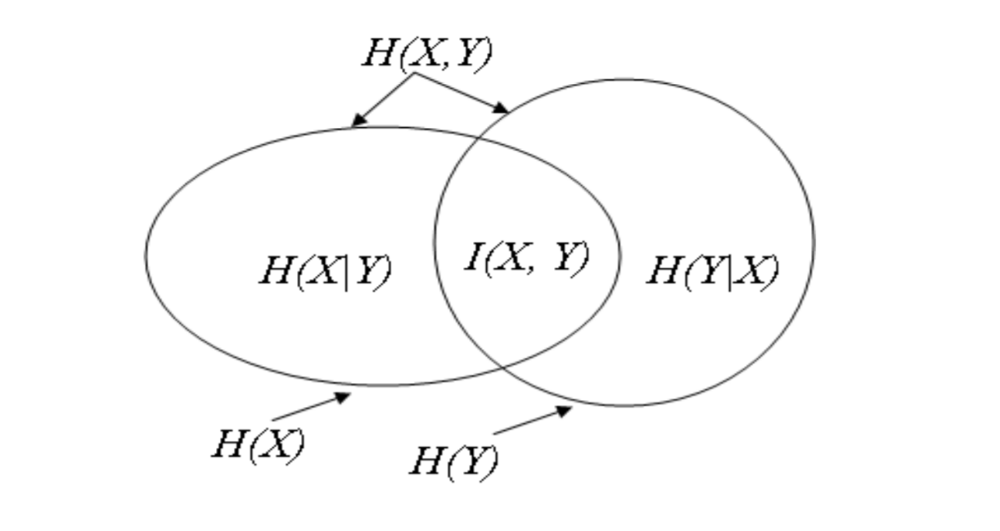

# 1 Entropy

## 1.1 熵（Entropy）

&emsp;假设我们有离散随机变量$X$，它的字母表为$\mathcal{X}$ ，它的信息熵为$H(X)$ ，那么有**熵**的定义公式  

$$H(X)=-\sum_{x\in\mathcal{X}}{p(x)log_2{p(x)}}$$

&emsp;在这里，我们约定$0\cdot log_2{0}=0$ 。从这里的公示表中，我们可以明白离散随机变量$X$的值是由$X$自身的可能性分布（probability distribution）决定的，而并非是由$X$ 自身的值决定的。  

**e.g.**   

&emsp;假定有这样一个二进制随机变量$X$ ,它可以为0与1且为1的概率均为$p$ ,为$0$的概率为$1-p$,计算二进制随机变量的熵。  

**解**  

$$\begin{aligned}H(X) &= -\sum_{x\in \mathcal{X}}{p(x)\cdot log_2{p(x)}}\\&= -p(0)\cdot log_2{p(0)}-p(1)\cdot log_2 {p(1)}\\&= -p\cdot log_2{(p)} -(1-p)\cdot log_2{(1-p)} \end{aligned}$$
  

&emsp;当$p=0$或者$p=1$时，也就是说$x$的值总是选择0或者总是选择1，$H(X)=0$，这意味着没有不确定性的情况下，没有信息。下图是一个熵$H(p)$相对于1的概率$p$的曲线图，我们可以发现，当$p=\frac{1}{2}$ 时，熵$H(p)$拥有最大值1，说明此时拥有最多的信息。由此，我们可以明白，**变量的不确定性越大，它便拥有越多的信息**。

## 1.2 联合熵（Joint Entropy）与条件熵（Conditional Entropy)

&emsp;**联合熵**：假定有一对随机变量$(X,Y)$有一个联合分布（joint distribution）$p(x,y)$，那么联合熵为   

$$H(X,Y)=-\sum_{x\in \mathcal{X}}{\sum_{y\in \mathcal{Y}}{p(x,y)\cdot log_2{p(x,y)}}}$$
  

&emsp;**条件熵**则为  

$$H(X|Y)=-\sum_{x\in \mathcal{X}}{\sum_{y\in \mathcal{Y}}{p(x,y)\cdot log_2{p(x|y)}}}$$
  

&emsp;值得一提的是，  

$$p(y|x)=\frac{p(x,y)}{p(x)}$$

&emsp;二者之间的关系为  

$$H(X,Y)=H(X)+H(Y|X)=H(Y)+H(X|Y)$$
  

&emsp;通过上一个式子，我们还可以获得**互信息**（mutual information）的定义,

$$H(X)-H(X|Y)=H(Y)-H(Y|X)\triangleq I(X,Y)$$
   

&emsp; 即，

$$I(X,Y)=-\sum_{x\in X}{\sum_{y \in Y}{p(x,y)log_2{\frac {p(x)p(y)}{p(x,y)}}}}$$
   

下面的Venn图表示几个熵之间的关系，

&emsp;下面的Venn图表示$H(X,Y)，H(X|Y)，H(Y|X)，H(X)，H(Y)，I(X,Y)​$之间的关系，

## 1.3  多随机变量的联合熵

&emsp;**多随机变量联合熵**定义为，

$$H(X_1,X_2,...,X_n)=-\sum_{x_1\in\mathcal{X_1}}{\sum_{x_2\in\mathcal{X_2}}{...\sum_{x_n\in\mathcal{X_n}}{p(x_1,x_2,...,x_n)log_2{p(x_1,x_2,...,x_n)}}}}$$

&emsp;**熵的链式规则**

$$H(X_1,X_2,...,X_n)=\sum_{i=1}^{n}{H(X_i|X_{i-1},...,X_1)}$$
  

## 1.4 熵与互信息的性质

&emsp;**杰森不等式**（Jenson's inequality）:如果一个函数$f(x)$在区间$(a,b)$是凸函数，对于$x_1,x_2,...,x_n\in(a,b)$，我们有  

$$f(\sum_{i=1}^{N}{p_ix_i})\le\sum_{i=1}^{N}{p_if(x_i)}$$
  

&emsp;其中，$0\le p_i \le 1$，并且$\sum_{i=1}^{N}{p_i}=1$。当且仅当$f$严格凸且$x_1=x_2=...=x_3$时，等于成立。  

&emsp;利用**杰森不等式**，我们可以获得以下有关熵、互信息的性质。

+ 假定一个离散时间的随机变量$X$有一个字母表$\mathcal{X}$，它的尺寸为$|\mathcal{X}|$，我们可以有，

  
$$H(X) \le log_2{|\mathcal{X}|}$$
  

  当$X$均匀地分布在$|\mathcal{X}|$上时，等式成立。

  ***Note***：如果想要证明，可以先转化为证明$log_2(|\mathcal{X}|)-H(X)\ge0$，将$log_2{|\mathcal{X}|}$转化为$\sum_{x\in X}{p(x)log_2{\mathcal{|X|}}}$，把$H(X)$替换为定义式$\sum_{x\in X}{p(x)log_2{p(x)}}$，二者合并之后再利用杰森不等式得到求证不等式的左侧大于0。

+ 对于任意两个随机变量$X$与$Y$，他们的互信息为$I(X,Y)\ge0$。  

  ***Note***：如果想要证明，从$I(X,Y)=-\sum_{x\in X}{\sum_{y \in Y}{p(x,y)log_2{\frac {p(x)p(y)}{p(x,y)}}}}$ 出发直接套用杰森不等式，化简可以得到$I(X,Y)\ge-log_2{1}=0$。

