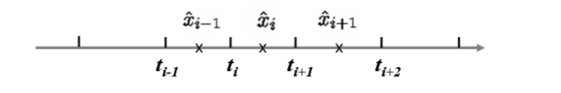
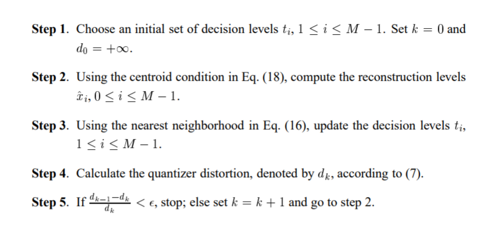

# Quantization and Rate-Distortion Theory

## 标化量化（Scalar Quantization）

&emsp;标化量化器（scalar quantizer）是一个从实数，由被称为量化索引（quantization index），$x\in R$到离散点，又被称为重建水平（reconstruction levels）或者量化输出（quantization outputs），的集合$\{{\hat{x_i}|1\le i \le{M}}\}$映射，假定为$Q$。

$$Q(x)=\hat{x_i}$$

&emsp;继而，我们有基于重建等级的决策域（decision region），  

$$S_i=\{x|Q(x)=\hat{x_i}\}$$
   

&emsp;如此，我们将实数线分割成了M个不相交的间隔（disjointed intervals）$[t_i,t_{i+1})$，$i=0,1,2,...,M-1$  

$$-\infty = t_0<t_1<...<t_M=+\infty$$
  

&emsp;其中，$t_i$被称为决策级别（decision levels）。

<cenetr>

## 量化器设计

### 量化失真

&emsp; 量化器的表现由量化失真（quantization distortion）衡量。原始值$x$与量化输出$\hat{x_i}$之间的量化失真为  

$$d(x,\hat{x_i}) = (x-\hat{x_i})^2$$
  

&emsp;因此，我们有平均量化失真（average quantization distortion）

$$d=\sum_{i=0}^{M-1}{\int_{t_i}^{t_{i+1}}{(x-\hat{x_i})^2p(x)dx}}$$
  

### 量化器设计的目标

&emsp;量化器设计的目标就是通过选择重建水平$\hat{x_i}$与决策水平$t_i$的最佳设置最小化平均量化失真。  

$$min_{\hat{x_i},t_i} {\sum_{i=0}^{M-1}{\int_{t_i}^{t_{i+1}}{(x-\hat{x_i})^2p(x)dx}}}$$</cenetr>  

&emsp;通常，很难获取该问题的近似方案。我们是通过两个最优标量量化器的必要条件来解决的。

### 最近邻条件（Nearest Neighbor Condition）

$$t_i = \frac {\hat{x}_{i-1}+\hat{x_i}}{2}$$

### 重心条件（Centroid Condition）

$$\hat{x_i}=\frac{\int_{t_i}^{t_{i+1}}{xp(x)dx}}{\int_{t_i}^{t_{i+1}}{p(x)dx}}$$
  

#### 最大算法（Max Algorithm） 

</cenetr>

### Lloyd算法（Lloyd Algorithm）  

&emsp;在很多实际设计方案里，$p(x)$是未知的，而且我们拥有的只是展示样例的集合$\mathcal{X}=\{x_n|1\le n \le N\}$ 。

$$\hat{x_i}=\frac{1}{||S_i||}\sum_{x\in S_i}{x}$$
  

&emsp;其中，$S_i=\{x\in \mathcal{X}|t_i \le x \le t_{i+1}\}$  。

&emsp;量化失真为  

$$d=\frac{1}{N}\sum_{i=0}^{M-1}{[\sum_{x\in S_i}{(x_i - \hat{x_i})^2}]}$$
     

## 向量量化（Vector Quantization）

$$d(x,\hat{x_i})=||x-\hat{x}_i||^2_2=\sum_{n=1}^{N}{(x_n-\hat{x}_{i,n})^2}$$</cenetr>

## 比率-失真分布（Rate-Distortion Theory）

&emsp; 假定$D$为squared error distortion，$R$为bit rate，$\sigma^2$为高斯源$\mathcal{X}$$\space \mathcal{N}(0,\sigma^2)$的方差，我们有rate-distortion

$$R(D)=\left \{ \begin{aligned}&\frac 12 log_2{\frac {\sigma^2}{D} } &, &0 \le D \le \sigma^2 \\ &0&, & D\gt \sigma^2 \end{aligned}\right.$$
